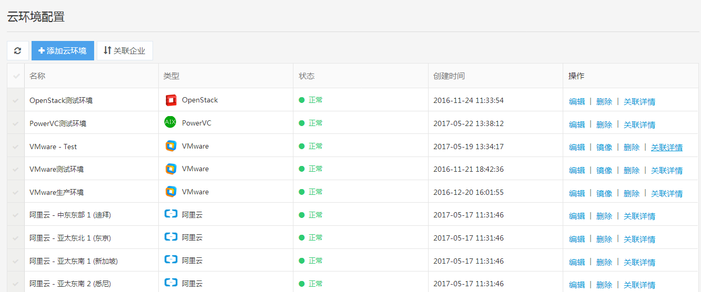

云环境管理

**接入阿里云、AWS、腾讯云、微软云环境**

点击顶端导航栏云环境，下拉列表会显示所有云环境列表，点击底部云环境配置，进入云环境配置页面。

</img>

点击左上角添加云环境，在弹出窗口选择您需要接入的云环境类型，点击下一步填写云环境信息。完成后点击提交。如果信息填写正确，将成功接入云环境并显示在云环境列表中。

</img>

填写云环境名称、描述、云账号ID、Access Key ID和Access Key Secret，这里的Access Key ID和Access Key Secret得在您的阿里云或腾讯云账户里查看，请一定填写正确。
</img>

查看您添加的第一个云环境
</img>

**接入VMware、OpenStack、PowerVC环境**

同样的，在点击添加云环境后，选择私有云环境，填写管理员或租户的地址、用户名、密码等信息，点击提交，若信息填写无误，会在页面右下角绿色提示“云环境添加成功”，否则提示"云环境验证不通过"，然后在云环境列表会展示所添加的云环境。
选择私有云环境
</img>

接入openstack环境

</img>

**关联企业**

点击左上角关联企业，可以查看关联企业列表。

</img>
